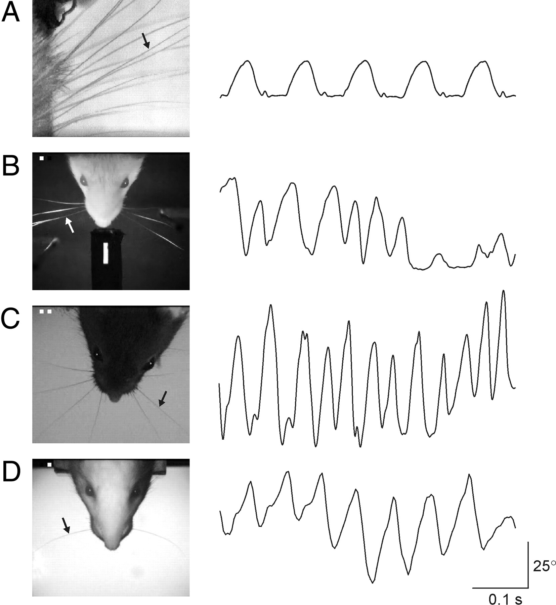

Neuroscience Tutorial
=====================

Brain-AI Workshop 2017
----------------------

This document serves as an outline of some of the important differences
between the mammalian brain and artificial neural networks.

### Spikes vs. Rate

-   Spikes are the information currency of the brain.
-   Spikes are energetically expensive. The brain uses about 1/5 of the
    energy of the body.
-   The only way for a neuron in one part of the brain to send
    information to a neuron in another part of the brain is by
    generating a spike (i.e. an action potential) which will travel
    along the axon and release transmitter.
-   How do we measure spikes?
    -   Electrophysiology:
        -   Single-unit recording with metal or glass electrodes.

    -   Optical imaging (indirect):
        -   voltage sensitive dyes, Ca++ imaging

-   Using mean-field approximation^[1](#fn1)^ of spiking networks, we
    can approximate populations of neurons using **rate-based models**:
    simple dynamical systems. E.g. \\[\\frac{dX\_i}{dt} =
    \\frac{-X\_i}{\\tau} + f(W\_iX\_i + E\_{ext} +
    \\mathcal{N}(0,\\sigma)) \\]

    -   rate-models have been very popular and successful for modeling
        decision-making and working-memory^[2](#fn2)^.
    -   Tools for measuring populations of neurons:
        -   Electrical: Multiunit, LFP, EEG, MEG
        -   fMRI: does not measure neural activity. It measure
            metabolism that is linked to neural activity.
        -   PET: uses radioactive isotopes. Useful for *in vivo*
            pharmacology.
        -   optical imaging: wide-field imaging of different sensors or
            intrinsic changes.

-   Current controversy: **rate-coding vs. phase-coding of information
    in the brain**^[3](#fn3)^

    -   Rhythms are all over the brain. Some brain areas show clear
        phase-encoding, where the spikes line up with the phase of
        oscillations. Seems to be important for information
        transmission^[4](#fn4)^ 
    -   Some rhythms are really *clocks*^[5](#fn5)^. They have
        long-range phase coherence and are created by **central pattern
        generators**. 
    -   Some rhythms are due to resonance. e.g. ringing a bell.
        ^[6](#fn6)^
    -   There is still substantial debate about the importance of
        oscillations in cognition.

### Brains are stochastic

-   There is irreducible noise in the brain, definitely due to brownian
    fluctuations in proteins, maybe quantum noise.
-   A key source of noise is due to **release failure**. When an action
    potential arrives at the terminal there is only a [chance for
    neurotransmitter to be
    released.](http://www.nature.com/nrn/journal/v10/n5/full/nrn2634.html)
-   **Noise in behavior is good**. Stochastic organisms in competitive
    environments dominate organisms with stable strategies.^[7](#fn7)^
-   Is this the brain equivalent of dropout?

### Vanishing/exploding gradients / [criticality](http://journal.frontiersin.org/article/10.3389/fphys.2012.00163/full)

-   neuron networks face same problem [*in
    vivo*]( "i.e. in a living animal") and [*in
    silico*]( "i.e. in silicon")
-   How do you filter/amplify/process an input in a deep or recurrent
    network without having that input either:
    -   quickly die away (e.g. coma)
    -   quickly explode (e.g. epilepsy)

-   What's the brain's solution to this? Still an open question.
    -   Many mechanisms for normalization in both space and in time.
    -   Normalization has been demonstrated to support [optimal
        information
        transmission](https://en.wikipedia.org/wiki/Horace_Barlow) and
        [attention](https://en.wikipedia.org/wiki/Normalization_model).
    -   Normalization *in time* included homeostatic plasticity. It's as
        if each neuron "knows" what it wants its own mean output to be.
        If its output is less than that set point it will increase its
        input weight; if its output is more than that set point it will
        reduce its input weights.[\^homeo]

### Brains have multiple *conflicting* objective functions

-   Basic drives, innate behaviors & *Unconditioned Stimuli*:

    -   Thirst
    -   Hunger
    -   Reproduction
    -   Fear (e.g. innate responses to predatory cues)
    -   Social (e.g. maternal care)

-   Because of competing priorities, the brain must perform some
    functions like an operating system. Has to deal with prioritization
    and race conditions.

    -   Can only reach for my beer or my wings with my empty hand.
    -   Can only look at my phone or at my wife.

-   Despite this, brains rarely crash! (although, people do pass out in
    response to trauma, pain, stress).

### Brains have a continuum of timescales

-   This is true for both information transmission and for plasticity.
-   Transmission: AMPA receptors open time is a few milliseconds. NMDA
    receptor open time is a few hundred milliseconds. mGlur receptor
    activation can last for seconds.
-   Learning: Thousands of molecules involved in learning and memory.
-   The transformation from an "immediate" to "short-term" to
    "long-term" memory is seamless (e.g. we are not consciously aware of
    the transition). But we know there are distinct mechanisms at play
    for different time-scales.
-   The brain also exhibits **meta-plasticity**. Synaptic strength (i.e.
    connection weights) are not characterized only by their value but
    also but how easy they are to change.

### Brains are modular recurrent networks

-   Evolution of brains:
    -   reuse earlier bits.

-   Specialization for:
    -   rhythm generation. e.g. breathing (brainstem)
    -   **control system** (spinal cord)
    -   spatial processing (tectum)
    -   episodic memory / navigation (hippocampus)
    -   classical conditioning (amygdala)
    -   reinforcement learning (dopamine / basal ganglia)
    -   skill learning (basal ganglia)
    -   executive function (prefrontal cortex)

-   These specializations result in a *taxonomy* of functions subserved
    by different parts of the brain:

  Term                          Meaning                                                                                                                                                                                                                                                                                           Module
  ----------------------------- ------------------------------------------------------------------------------------------------------------------------------------------------------------------------------------------------------------------------------------------------------------------------------------------------- ------------------------------------------------------------------
  Episodic Memory               Autobiographical memory. E.g. what you had for breakfast yesterday. Where you went to school.                                                                                                                                                                                                     medial temporal lobe / acetylcholine
  Source Memory                 Knowledge about how you know something.                                                                                                                                                                                                                                                           E.g. when did you first hear about action potentials?
  Semantic Memory               Information about the world. The president of China. The first month of the year.                                                                                                                                                                                                                 distributed?
  Procedural Memory             How to do something. E.g. play the piano, ride a bike.                                                                                                                                                                                                                                            motor cortex / basal ganglia / dopamine
  Emotional memory              An association between a thing and a value (good or bad). Chocolate tastes good. Fire burns. A certain dog bites.                                                                                                                                                                                 Amygdala
  Working memory                a short-term form of memory often associated with combining or integrating multiple items in memory together. E.g. doing math problem in your head, trying to count cards at a casino, finding the largest number in a list. Generally, the items in memory are discarded soon after finishing.   prefrontal cortex (for longer durations, hippocampus).
  Spatial working memory        like working memory but in particular for a location in space. e.g. when playing basketball keeping track of where the players are on the court.                                                                                                                                                  frontal eye field and other regions.
  LTP/D                         Long-term potentiation/depression. Changes in synaptic strength that last for more than 1 day. Requires new protein synthesis and changes to cyto-skeleton                                                                                                                                        
  STP/D                         Short-term potentiation/depression. Changes in synpatic strength that last for a short time (usually 30 min - a few hours)                                                                                                                                                                        
  Spatial Attention             enhancing processing of one part of the world.                                                                                                                                                                                                                                                    frontal-parietal-tectal circuit, acetylcholine
  Feature Attention             Focused processing on a non-spatial dimension of the world. E.g. looking for a friend in a red jacket. Focused listening of one instrument at the symphony.                                                                                                                                       Depends on modality. Higher sensory cortex with PFC
  Overt vs. Covert attention    Overt attention is externally observable. e.g. by measuring eye/head/body positions. Covert attention is not-externally observable. e.g. "looking" at someone out of the corner of your eye or shifting your focus from vision to hearing or touch.                                               Depends. For switching modulality, probably thalamus.
  Habit                         an action that is performed regardless of the outcome. For example, if you eat a snack every day at 5pm, and then one day you have a huge meal at 4pm and you are really full but you still eat the snack, then it is a habit.                                                                    
  Goal-directed action          opposite of habit. A behavior that is performed to achieve a goal. Generally more flexible than habits.                                                                                                                                                                                           dopamine
  Motivation                    Used to describe levels of drive. (i.e. scaling of objective functions). When we are thirsty we are motivated to get water. But once we are not thirsty the same outcome (water) has less value.                                                                                                  dopamine, noradrenaline, opiates
  Behavioral inhibition         e.g. self-control Ability to suppress actions based on context. E.g. you want to eat the cookie, but you are trying to lose weight, or you want your friend to have the last one                                                                                                                  prefrontal cortex, serotonin
  perceptual decision-making    Making a decision about some physical property of an object. E.g. is that picture hanging straight? Is there a pothole in the road? Will the ping-pong ball miss the table                                                                                                                        probably secondary sensory cortex.
  value based decision-making   also called economic or financial decision-making. Should I buy this stock? Should I ask that girl out on a date? Should I wait for the bus? Most real decisions involve both perceptual and value-based parts.                                                                                   striatum / nucleus accumbens / orbital frontal cortex / dopamine

Learning
--------

The brain is very plastic (meaning the connection weights can be
changed). There is a huge amount of diversity in the learning rules in
the brain. For almost every cognitive function listed above there is a
corresponding learning rule.

Why have such diverse rules? Probably to match statistics of
environment. Things that don't change much should have correspondingly
slow learning rates.

We know a lot about the molecular mechanisms of learning. Probably the
best studied feature of the brain.

### Local Learning

-   [Hebbian Plasticity](https://en.wikipedia.org/wiki/Hebbian_theory):
    Neurons that fire together wire together.
-   Spike-Timing Dependent Plasticity.\
     

### Global Learning

-   Dopamine release from the ventral tegmental area is a global
    learning signal. It seems to be a reward prediction error.\
     
-   Dopamine is a gate for plasticity in other parts of the brain, so
    synapses that were active just before the dopamine release will get
    strengthened.^[8](#fn8)^

### Supervised Learning

-   Observational learning: songbird system. Young male listens and
    remembers father's song (or other tutor). Sings to himself and tries
    to match against remembered song.
-   Instructional learning: e.g. this tutorial
-   Multi-modal calibration: using vision as a teaching signal for the
    motor system. This process is constant through out life.
    -   Necessary for adapting flexibly to different environments
        (walking, running, swimming) and situations (carrying something,
        after injury) and during development.

-   This kind of learning can happen very quickly. Especially if
    motivation/attention is high.
-   Some forms of supervised learning have a critical period.

### Unsupervised learning

-   Reinforcement learning (Operant or Instrumental learning) : learn
    the value of taking an action in a certain state.
-   Classical conditioning (e.g. fear conditioning): learn the value of
    a state (action is irrelevant).
-   This kind of learning can happen very quickly and last a life time.
    Especially if motivation/attention is high. With fear conditioning,
    a single pairing of a novel tone with a painful electric shock can
    general a lifelong memory of the experience.

### Perceptual/Statistical Learning == autoencoder

-   Language learning.
-   Learning the statistics of the natural sensory world.
-   Usually happens early in development.
-   Critical period for plasticity.

### Motor Learning

-   sometimes supervised: e.g. you can use hearing to adjust your hand
    position on the guitar.
-   sometimes unsupervised: you just get a hit/miss signal and have to
    explore action space.
-   learning to perform a task: play a musical instrument, repeat a
    sequence, knife skills.
-   Depending on difficulty and motivation can happen over seconds,
    minutes or hours. Practice, practice, practice.

### hierarchical learning

-   We organize actions into subgoals.

Are modern recurrent networks (LSTM/GRU) biologically plausible?
----------------------------------------------------------------

-   yes.
-   It is *highly* unlikely that one LSTM node is equivalent to one
    neuron (but see Hasselmo^[9](#fn9)^).
-   What's more likely is that one LSTM unit represents a subpopulation
    of neurons configured as a bi-stable or line attractor. It may be
    (wild speculation) that cortical columns are analogous to an LSTM
    unit.

Why should be care about any of this?
-------------------------------------

-   The brain has evolved over millions of years of evolution.
-   It may contain solutions to many problems of interest to the machine
    learning community.
-   However, it's important to appreciate the constraints faced by the
    organism and the selective pressures that resulted in this
    particular solution to the "fitness" problems.
-   Some things that constrain brains:
    -   size (the brain is mushy... too big and it won't hold together
        well)
    -   speed (but not for sloth!)
    -   energy (maybe?)
    -   wiring (humans have extra white matter)
    -   information in the environment (e.g. naked mole rats)

* * * * *

1.  [http://galton.uchicago.edu/\~nbrunel/teaching/winter2014/]() see
    21-rate.pdf [↩](#fnref1)

2.  Kopec, Charles D, Jeffrey C Erlich, Bingni W Brunton, Karl
    Deisseroth, and Carlos D Brody. “Cortical and Subcortical
    Contributions to Short- Term Memory for Orienting Movements.” Neuron
    88, no. 2 (October 2015): 367–377. doi:10.1016/j.neuron.2015.08.033.
     [↩](#fnref2)

    Wang, Xiao-Jing. “Decision Making in Recurrent Neuronal Circuits.”
    Neuron 60, no. 2 (October 23, 2008): 215–34.
    doi:10.1016/j.neuron.2008.09.034.

    Wong, Kong-Fatt, and Xiao-Jing Wang. “A Recurrent Network Mechanism
    of Time Integration in Perceptual Decisions.” Journal of
    Neuroscience 26, no. 4 (January 25, 2006): 1314–28.
    doi:10.1523/JNEUROSCI.3733-05.2006.

3.  [Rate vs. temporal
    coding](http://charlesfrye.github.io/FoundationalNeuroscience/47/) [↩](#fnref3)

4.  Dean HL, Hagan MA, Pesaran B. Only coherent spiking in posterior
    parietal cortex coordinates looking and reaching. Neuron. 2012.
    73(4):829-841) [↩](#fnref4)

5.  Delcomyn, F. “Neural Basis of Rhythmic Behavior in Animals.” Science
    210, no. 4469 (October 31, 1980): 492–98.
    doi:10.1126/science.7423199. [↩](#fnref5)

    Marder, Eve, and Dirk Bucher. “Central Pattern Generators and the
    Control of Rhythmic Movements.” Current Biology 11, no. 23 (November
    27, 2001): R986–96. doi:10.1016/S0960-9822(01)00581-4.

6.  [http://www.jneurosci.org/content/31/26/9658.short]() [↩](#fnref6)

7.  Maynard Smith J. 1982. Evolution and the Theory of Games. London:
    Cambridge Univ. Press [↩](#fnref7)

8.  [http://journal.frontiersin.org/article/10.3389/fnsyn.2010.00146/full]() [↩](#fnref8)

9.  Egorov, Alexei V., Bassam N. Hamam, Erik Fransén, Michael E.
    Hasselmo, and Angel A. Alonso. “Graded Persistent Activity in
    Entorhinal Cortex Neurons.” Nature 420, no. 6912 (November 14,
    2002): 173–78. doi:10.1038/nature01171. [↩](#fnref9)

