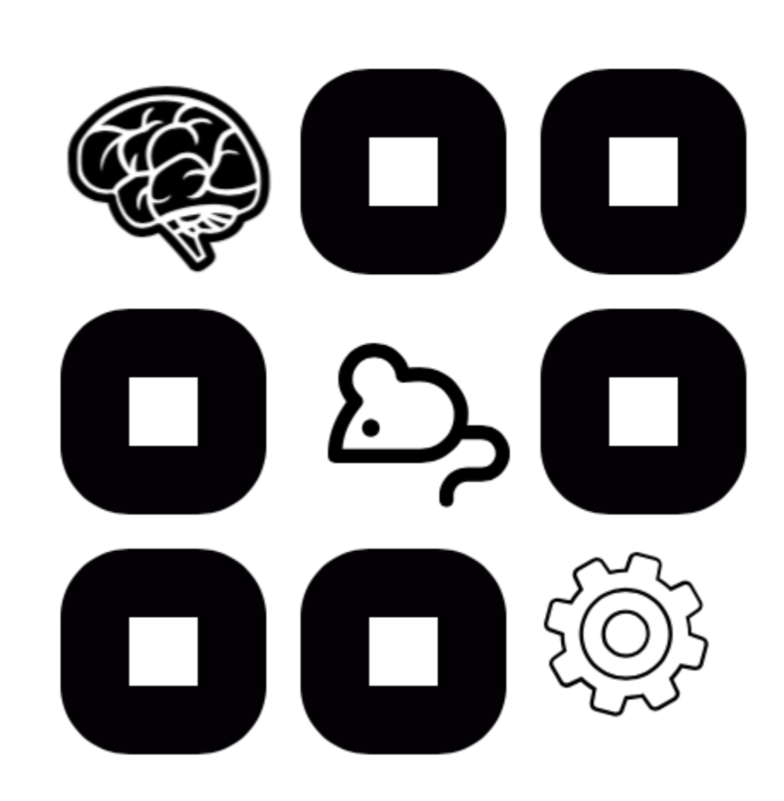

# The Erlich Lab

+ [Internal Links](https://int.erlichlab.org)   
+ [Site at NYU-Shanghai](http://neuro.shanghai.nyu.edu/erlich_lab)  
+ [Publications](https://scholar.google.com.hk/citations?user=kI5EI3AAAAAJ&hl=en)  
+ [Twitter](https://twitter.com/erlichlab)  
+ [GitHub](https://github.com/erlichlab)  

### About The Lab

The Erlich Lab is generally interested in neural mechanisms underlying cognition. We currently have ongoing projects related to economic decision-making, integrating of value and perceptional information, spatial cognition and motor planning. We are located in Shanghai, China. Our animal facilities are hosted at the [East China Normal University campus near Zhongshan Park](http://english.ecnu.edu.cn/1810/list.htm), where we also run human neuroimaging studies using their fMRI facilities. There is a human behavioral research lab hosted at the [NYU Shanghai campus in Pudong](https://wp.nyu.edu/shbeel/).

The lab will be moving to the [Sainsbury Wellcome Centre for Neural Circuits and Behaviour](https://www.sainsburywellcome.org/web/) in London, UK at the end of 2021. 

### Hiring

The lab at NYU Shanghai is ramping down, but the lab in London is ramping up. If you are interested in a post-doc, PhD, staff or internship please write to apply@erlichlab.org, including your CV and a cover letter explaining your interest.

## Lab Members

[**Jeffrey Erlich, PI**](http://neuro.shanghai.nyu.edu/erlich_lab), [CV](http://www.cns.nyu.edu/~jerlich/dl/jce_cv.pdf)

### Postdocs

Chaofei Bao

### Graduate Students

[Josh Mōller-Mara](http://jmm.io)\
Jingjie Li\
Liujunli Li\
XiaoYue Zhu

### Staff

Yingkun Li\
<!-- 
### Undergraduates

### Interns
 -->

### Alumni

Xirui Zhao (now doing grad school in CS in USA)\
Shengjie Xu (now doing PhD in Germany)\
Xuan Wen (now finishing undergraduate in U Rochester)\
Nengneng Gao (Took a teaching position)\
Ce Ma (Graduate school in CS, in USA)\
[Sylvain
Dubroqua](https://research.shanghai.nyu.edu/centers-and-institutes/brain/people/sylvain-dubroqua)\
[Jenya
Lukinova](https://research.shanghai.nyu.edu/centers-and-institutes/brain/people/evgeniya-lukinova) (Now teaching at NYU Shanghai)\
[Hung-Tu Chen](https://github.com/transedward)\
Xiangci Li (now doing PhD in CS in Texas)\
Tomasz Merta (in Med School in Singapore)\
Bo Zhang (Data Science at Apple)\
Lingqi Zhang (PhD at U Penn)\
Michael Lukiman\
Yuyue Wang\
Shine Zhou\
Misya Erwin\
Cequn Wang (Neuroscience tech company in Shanghai https://neuronlab.cn/)\
Yidi Chen (Personal trainer in Shanghai)\
Wanning Fu\
Jonathan S. Lin\
Stephen Mathew\
Chloe Haddaway (Lab Manager at NYU Med School)\
Xinying Zhang\
Brianna Lee Fu

### Collaborators

[Steve Lehrer](http://post.queensu.ca/%7Elehrers/)\
[Zheng \"ZZ\"
Zhang](https://shanghai.nyu.edu/academics/faculty/directory/zheng-zhang)\
[Ming Hsu](http://neuroecon.berkeley.edu)
